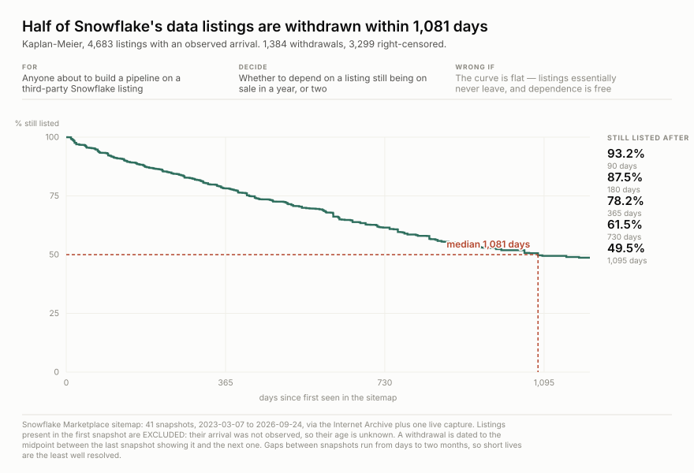

<h1 align="center">wss-snowflake-marketplace</h1>

<p align="center">
  <strong>Which data products are withdrawn from sale, captured weekly</strong>
</p>

<div align="center">

  <a href="https://github.com/q3dresearch/wss-snowflake-marketplace/actions/workflows/capture.yml"></a>
  <a href="https://github.com/q3dresearch/wss-snowflake-marketplace/commits"></a>
  <a href="https://github.com/q3dresearch/wss-snowflake-marketplace/blob/main/LICENSE"></a>

</div>

<p align="center">
  <sub>fleet: <a href="https://github.com/q3dresearch/wss-engine">engine</a> · <a href="https://github.com/q3dresearch/wss-apify">apify</a> · <strong>snowflake marketplace</strong> · <a href="https://github.com/q3dresearch/wss-flood-warnings">flood warnings</a> · <a href="https://github.com/q3dresearch/wss-hugging-face">hugging face</a></sub>
</p>

Every data product on sale in the Snowflake Marketplace — **4,039 listings** —
taken weekly from the publisher's own sitemap. A listing that is withdrawn from
sale simply leaves it. There is no status meaning delisted, no archive, and no
way to tell afterwards from the listing URL.



**A data listing has a median life of about three years, and a fifth are gone
within one.** Kaplan-Meier over 4,683 listings whose arrival was observed across
41 sitemap snapshots, 2023-03-07 to 2026-09-24: 1,384 withdrawals, 3,299 still
listed and right-censored.

**Every source, its live URL, its licence and its last stored capture is listed
in [SOURCES.md](SOURCES.md)** — generated by `wss sources`, so it cannot drift
from the registry.

## Questions this exists to answer

| # | Question | Status |
| --- | --- | --- |
| Q1 | How long does a data product stay on sale? | **answered** — median 1,081 days; 93.2% survive 90 days, 78.2% a year, 49.5% three |
| Q2 | Is the marketplace growing, or churning at a growing size? | **answered — both.** 1,648 → 4,039 listings, but on 4,893 arrivals against 2,502 departures |
| Q3 | Which vendors exit, and do they go all at once or one product at a time? | open — the slug's leading token hints at a vendor but is not a published field |
| Q4 | Do whole categories die? | not observable — Snowflake publishes no category anywhere reachable |
| Q5 | Does a withdrawn listing still resolve at its own URL? | **answered — unanswerable.** Every path under /marketplace/ returns the same shell, so status carries no information |
| Q6 | Do withdrawals cluster in time — quarterly clearouts, or a steady trickle? | accruing — visible in the backfill but the snapshot gaps are uneven |

## The backfill needed no accumulation

The Internet Archive holds **46 mementos of this sitemap**, 40 of them carrying
listings. With the first live capture that is **41 snapshots over 3.5 years** —
enough for the survival curve above on day one.

**Two analyses were thrown away before that one.** An "age at last sight" table
reported 88.1% of 731-day-olds still alive, which is survivorship: to *be* that
old and observed you had to survive. Then a conditional hazard that *rose* with
age, 7.9% → 15.6% — the signature of right-censoring, because recent arrivals
have not had time to die. Kaplan-Meier handles both; ad-hoc age bands manufacture
a finding that is not there.

Listings present in the first snapshot are **excluded**: their arrival was not
observed, so their age is unknown, and keeping them would inflate survival by
counting only the already-old.

**Do not pick a baseline by date.** The 2022-08-20 memento contains **zero**
listings — the sitemap did not carry them yet — so a naive oldest-versus-today
diff reports 0 departures and reads as perfect stability. Pick it by counting
listings in it.

## The detail page is worthless, and that was proved

A live listing, a departed listing, two garbage ids, a bare path and an unrelated
path **all return HTTP 200 at exactly 68,372 bytes with the same SHA-256.** One
static SPA shell for every URL under `/marketplace/`. So there is no provider, no
price, no usage count and no date anywhere reachable — and a 200 on a listing URL
proves only that the server answered.

**There is no denominator.** This is an arrivals-and-departures series and must
never be described as a popularity one.

## Requires engine v0.6.58

`app.snowflake.com/robots.txt` is `Disallow: /` followed by nine explicit `Allow:`
lines including `/sitemap.xml`. Engines before 0.6.58 used
`urllib.robotparser`, which returns the **first** matching rule rather than the
longest, and **refuse this source outright** — reporting
`skipped (robots_disallowed)` while the workflow stays green.

## Using it

```bash
B=https://raw.githubusercontent.com/q3dresearch/wss-snowflake-marketplace/main/derived/observations
duckdb -c "SELECT * FROM read_csv_auto('$B/2026-09.csv.gz') LIMIT 5"
```

```bash
python examples/load_observations.py      # sqlite + queries
python examples/chart-survival.py         # redraw from public/survival-*.json
```

`entity_id` is the Snowflake listing id (`GZSNZT9G`). Metrics: `listed` — whose
**absence** in a later capture is the withdrawal — plus `product_slug` and
`slug_first_token`. One capture is 653 KB.

## Licence

**Not established.** `app.snowflake.com/robots.txt` permits `/sitemap.xml` and the
marketplace paths; no licence statement was found and Snowflake's terms have not
been read for a redistribution grant. What is captured is **a list of public URLs
the publisher maintains for crawlers**, not vendor content — there is no dataset,
description or price in it. See [LICENSE-DATA](LICENSE-DATA).
